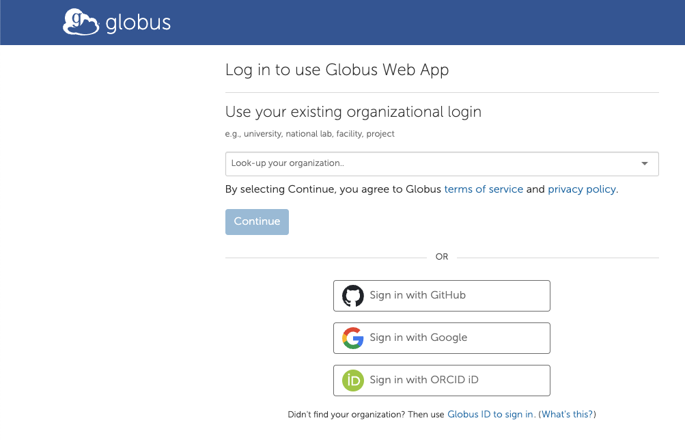
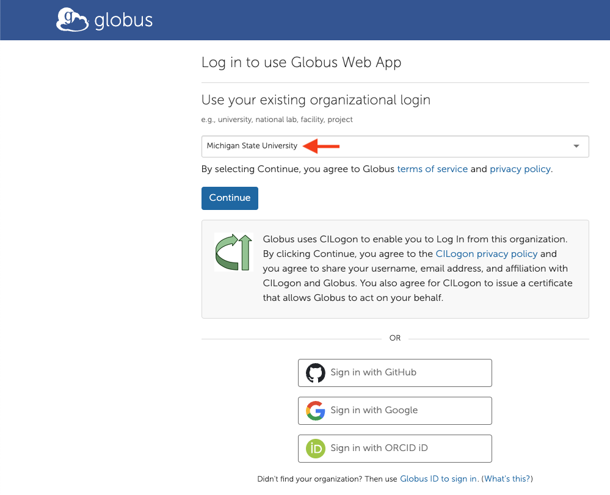
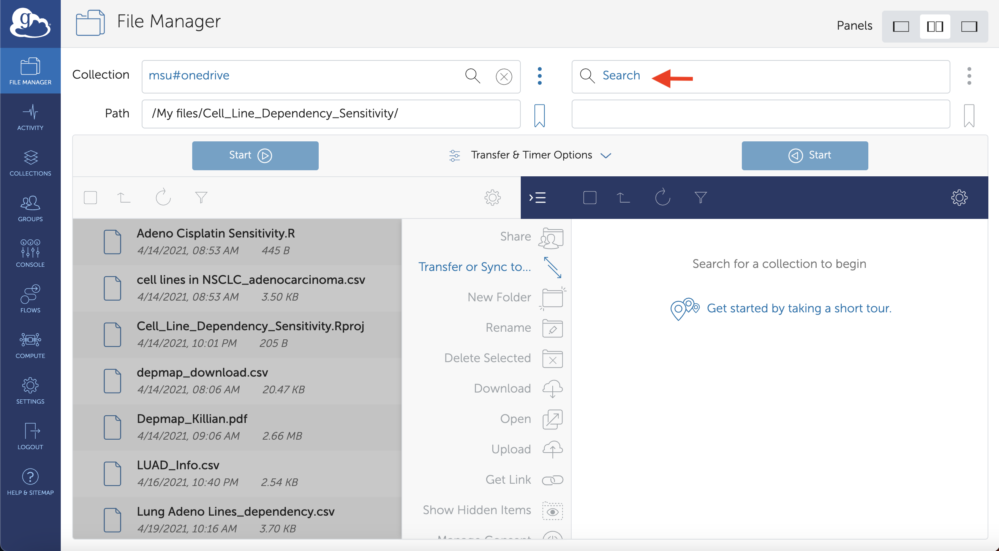
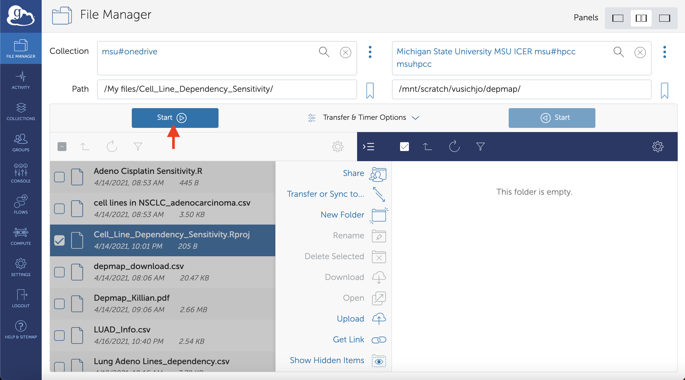
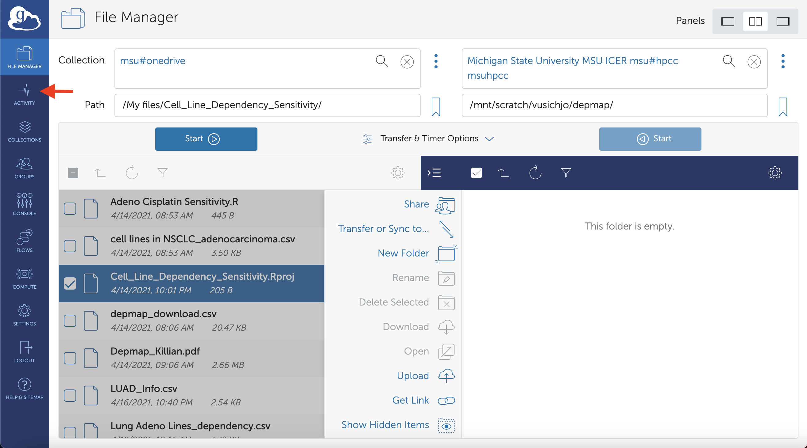

# Transferring Local Files to the MSU HPCC via Globus Connect Personal

This guide provides step-by-step instructions for transferring files from your local machine to the Michigan State University High-Performance Computing Center (MSU HPCC) using Globus Connect Personal. This setup is ideal for users new to Globus or needing to transfer files from a personal computer.

## Prerequisites

- **MSU NetID and Password**: Ensure you have an active MSU NetID and password.
- **HPCC Account**: You must have an account on the MSU HPCC.
- **Globus Account**: You’ll use your MSU credentials for authentication.
- **Globus Connect Personal**: Installed and configured on your local machine.
- **Network Access**: Ensure you have a stable internet connection.

## Step-by-Step Guide

### 1. Install Globus Connect Personal on Your Local Machine

- Visit [https://www.globus.org/globus-connect-personal](https://www.globus.org/globus-connect-personal).
- Download the installer for your operating system (Windows, macOS, or Linux).
- Follow the on-screen instructions to complete the installation.

### 2. Set Up Globus Connect Personal

- After installation, open Globus Connect Personal.

### 3. Access the Globus Web Interface

- Open your web browser.
- Go to [https://app.globus.org/](https://app.globus.org/).

### 4. Log In with Your MSU Credentials
- Use your MSU credentials to log in.

### 5. Authenticate with MSU

- You will be redirected to the MSU login page.
- Enter your **MSU NetID** and **password**.
- Click **"Login"**.
- After successful login, you'll be redirected back to the Globus web app.

  

### 6. Navigate to the File Manager

- On the left-hand side menu, click on **"File Manager"**.

  

### 7. Select the Source Collection (Local Files)

- From your computer, click on the **Globus Connect Personal** icon.
- Select **"Web: Transfer Files"** from the dropdown.

  

### 8. Select the Files to Transfer

- Once authenticated, your OneDrive files and folders will appear in the source panel.
- Navigate through the folders to locate the files you wish to transfer.
- Click to select the files or folders you want to transfer.
- You can select multiple items by holding down the **Ctrl** key (Windows) or **Command** key (Mac) while clicking.

  

### 9. Set Up the Destination Endpoint (msu#hpcc)

- Above the source panel, click on **"Transfer or Sync to..."** to open the destination panel on the right.
- In the destination panel, click on the empty search bar next to **"Collection"**.
- Type **"msu#hpcc"**.
- Select **"msu#hpcc"** or **"Michigan State University MSU ICER"** from the list.

  

### 10. Authenticate the MSU HPCC Endpoint (If Prompted)

- You may be prompted to authenticate the MSU HPCC endpoint.
- Click **"Continue"** or **"Authenticate"** as prompted.
- Follow any additional on-screen instructions to complete authentication.

  

### 11. Specify the Destination Path on the HPCC

- In the destination panel, locate the **"Path"** field.
- Enter the path where you want to store your data on the HPCC.
  - For example: `/mnt/scratch/$yourUsername`
  - **Replace** `$yourUsername` with your actual HPCC username.
- Press **Enter** or click the arrow button to navigate to this directory.
  - *Note*: If the directory doesn't exist, ensure you have the correct path or create the directory using HPCC resources.

  

### 12. Start the Transfer

- Review your selections:
  - Ensure the correct files are selected in the source panel.
  - Confirm the destination path is correct.
- Click the **"Start"** button to begin the transfer.

  

### 13. Monitor the Transfer Progress

- Click on **"Activity"** in the left-hand menu to view transfer progress.
- You can see active, completed, and failed transfers.
- Globus may send you an email notification when the transfer is complete.

  

## Tips for Successful Transfers

- **Large Files**: For larger files, ensure you have a stable internet connection to avoid transfer interruptions.
- **File Permissions**: After transferring, check file permissions on the HPCC if any access issues arise.

## Troubleshooting

If you encounter issues:
- Ensure your endpoint (local machine) is active and connected.
- Check that you are logged into Globus and MSU HPCC endpoints.
- Review [Globus support documentation](https://docs.globus.org/).

