# Transferring Files from MSU OneDrive to the MSU HPCC via Globus

This guide provides step-by-step instructions for transferring files from MSU OneDrive to the Michigan State University High-Performance Computing Center (MSU HPCC) using Globus. It's tailored for users who are new to Linux and High-Performance Computing (HPC).

## Prerequisites

- **MSU NetID and Password**: Ensure you have an active MSU NetID and password.
- **HPCC Account**: You must have an account on the MSU HPCC.
- **Globus Account**: No separate Globus account is needed; you'll use your MSU credentials.
- **OneDrive Files**: Files stored in your MSU OneDrive account that you wish to transfer.
- **Web Browser**: Access to a web browser like Chrome, Firefox, or Safari.

## Step-by-Step Guide

### 1. Access Globus Online

- Open your web browser.
- Go to [https://app.globus.org/](https://app.globus.org/).

  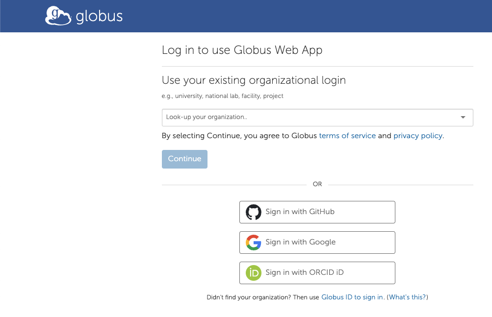

### 2. Log In with Your MSU Credentials

- On the Globus login page, find the section titled **"Use your existing organizational login"**.
- Click in the search bar under this section and type **"Michigan State University"**.
- Select **"Michigan State University"** from the dropdown list.
- Click the **"Continue"** button.

  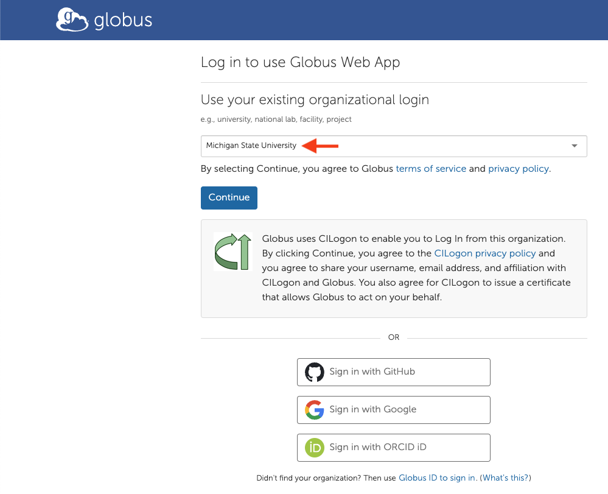

### 3. Authenticate with MSU

- You will be redirected to the MSU login page.
- Enter your **MSU NetID** and **password**.
- Click **"Login"**.
- After successful login, you'll be redirected back to the Globus web app.

  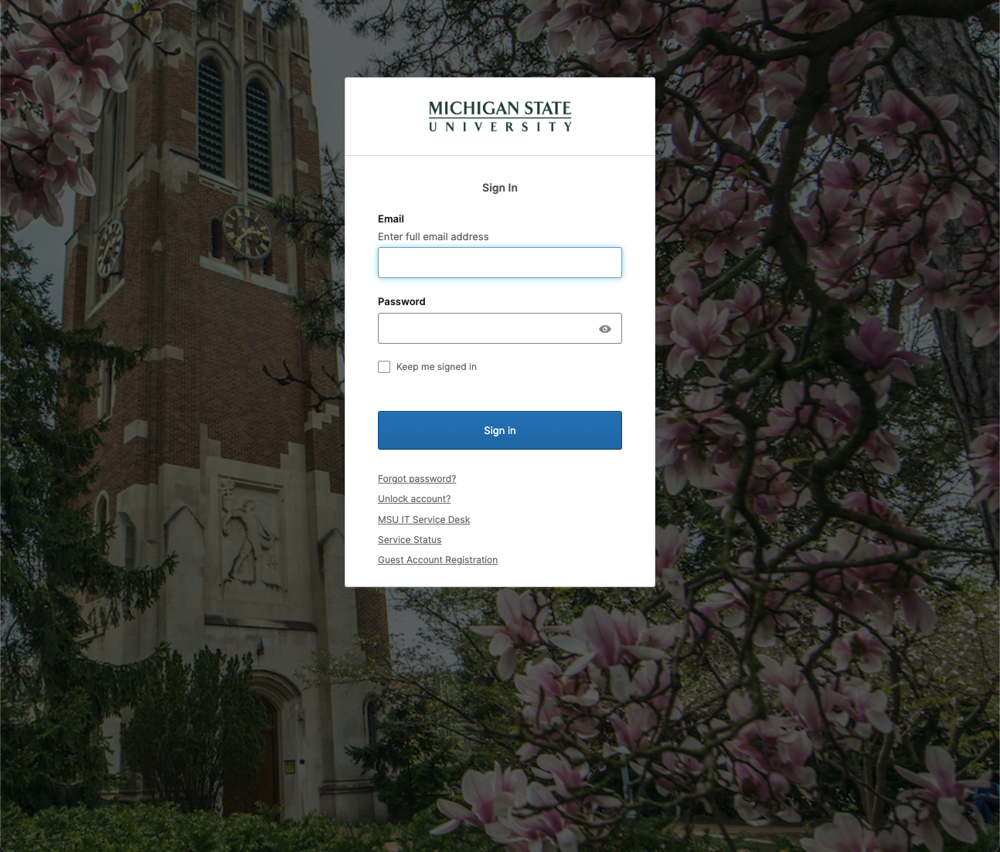

### 4. Navigate to the File Manager

- On the left-hand side menu, click on **"File Manager"**.

  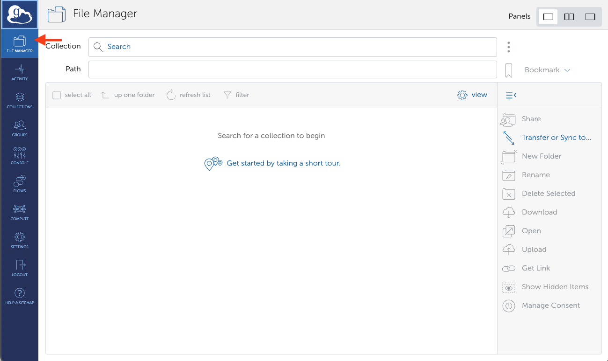

### 5. Select the Source Collection (msu#onedrive)

- In the **File Manager**, you'll see two panels side by side. The left panel is the **source** (where you're transferring data from).
- In the source panel, click on the empty search bar next to **"Collection"**.
- Type **"msu#onedrive"**.
- Select **"msu#onedrive"** from the search results.

  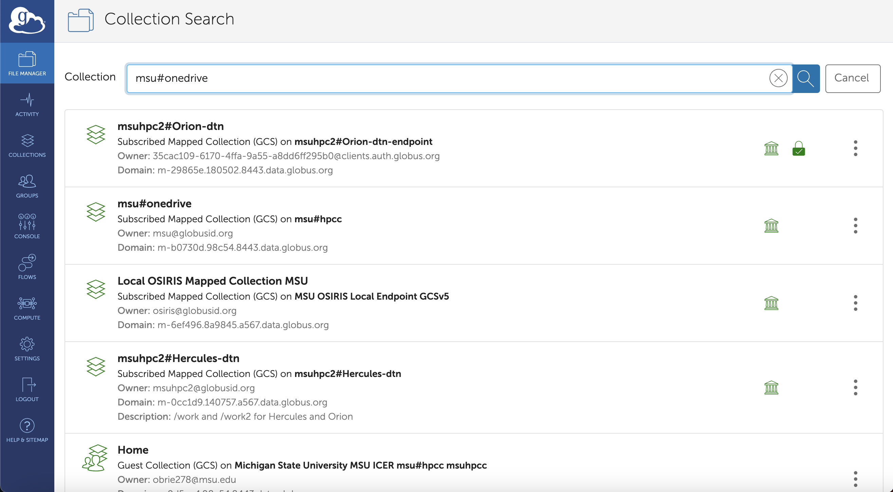

### 6. Authenticate and Register Credentials for OneDrive

- You will be prompted to authenticate and register your OneDrive credentials.
- Click **"Continue"** or **"Authenticate"** as prompted.
- A Microsoft sign-in window will appear.
- Enter your **MSU email address** (e.g., `yournetid@msu.edu`) and click **"Next"**.
- Enter your **MSU NetID password** and click **"Sign In"**.
- Approve any multi-factor authentication (MFA) prompts if enabled.
- Accept any permissions requested to allow Globus access to your OneDrive files.

  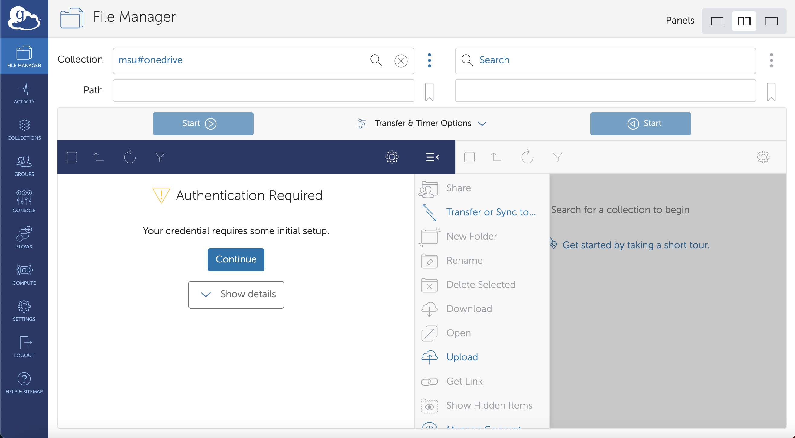

  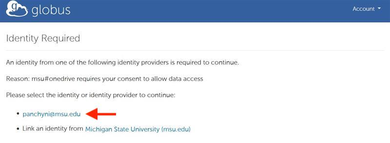

  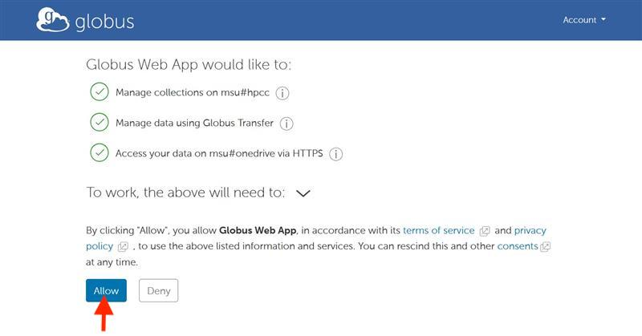

### 7. Select the Files to Transfer

- Once authenticated, your OneDrive files and folders will appear in the source panel.
- Navigate through the folders to locate the files you wish to transfer.
- Click to select the files or folders you want to transfer.
  - You can select multiple items by holding down the **Ctrl** key (Windows) or **Command** key (Mac) while clicking.

  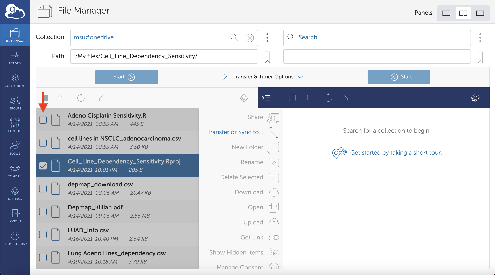

### 8. Set Up the Destination Endpoint (msu#hpcc)

- Above the source panel, click on **"Transfer or Sync to..."** to open the destination panel on the right.
- In the destination panel, click on the empty search bar next to **"Collection"**.
- Type **"msu#hpcc"**.
- Select **"msu#hpcc"** or **"Michigan State University MSU ICER"** from the list.

  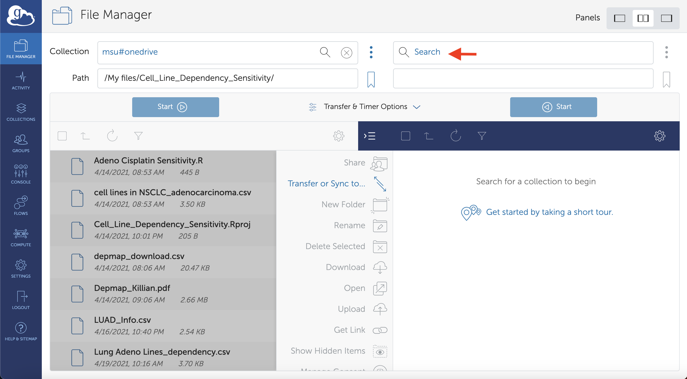

### 9. Authenticate the MSU HPCC Endpoint (If Prompted)

- You may be prompted to authenticate the MSU HPCC endpoint.
- Click **"Continue"** or **"Authenticate"** as prompted.
- Follow any additional on-screen instructions to complete authentication.

  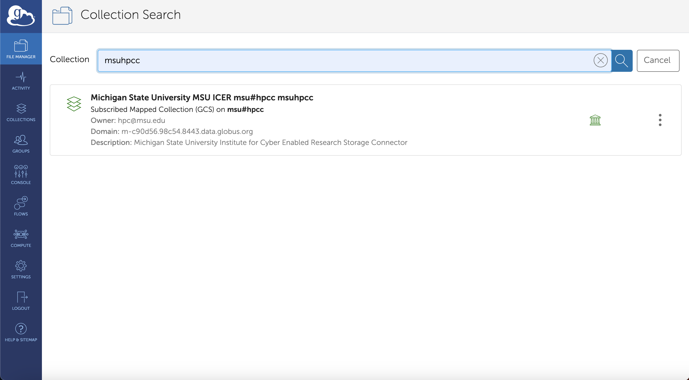

### 10. Specify the Destination Path on the HPCC

- In the destination panel, locate the **"Path"** field.
- Enter the path where you want to store your data on the HPCC.
  - For example: `/mnt/scratch/$yourUsername`
  - **Replace** `$yourUsername` with your actual HPCC username.
- Press **Enter** or click the arrow button to navigate to this directory.
  - *Note*: If the directory doesn't exist, ensure you have the correct path or create the directory using HPCC resources.

  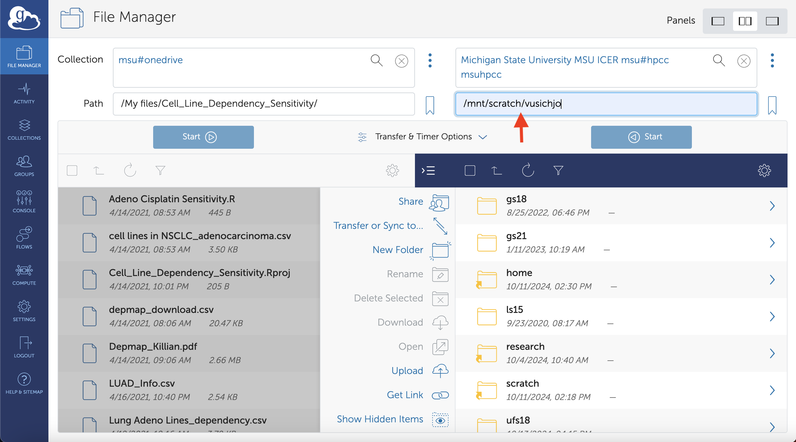

### 11. Start the Transfer

- Review your selections:
  - Ensure the correct files are selected in the source panel.
  - Confirm the destination path is correct.
- Click the **"Start"** button to begin the transfer.

  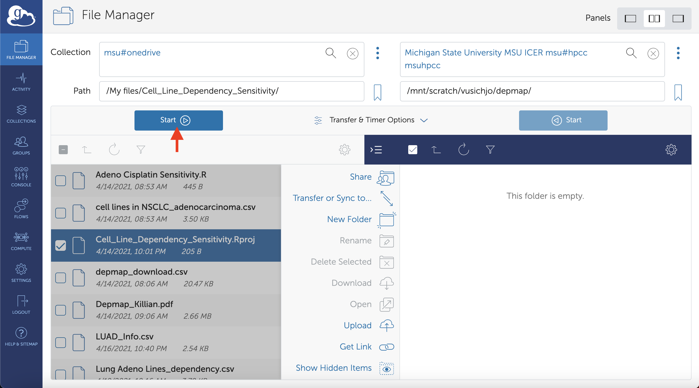

### 12. Monitor the Transfer Progress

- Click on **"Activity"** in the left-hand menu to view transfer progress.
- You can see active, completed, and failed transfers.
- Globus may send you an email notification when the transfer is complete.

  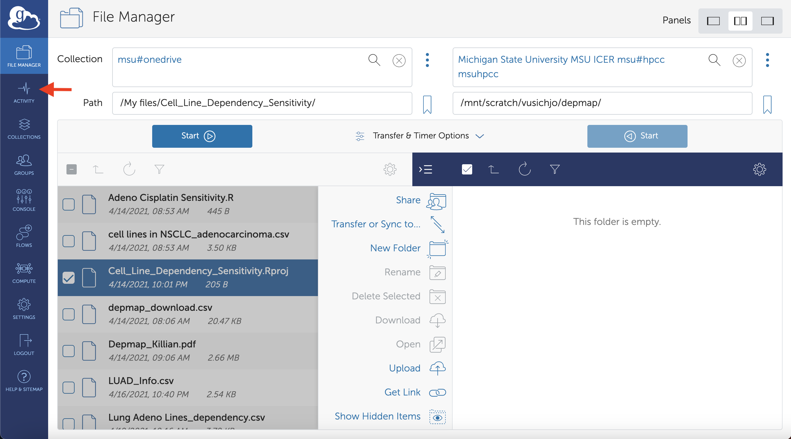

## Additional Information

### Understanding Key Terms

- **Endpoint**: A storage system or server where data can be transferred to or from.
- **Collection**: A shared set of data accessible via an endpoint.
- **Path**: The specific directory location within an endpoint's file system.

### Tips for New Users

- **File Permissions**: Ensure you have permission to access the source files and write to the destination directory.
- **Data Size**: Large data transfers may take time; you can close your browser, and the transfer will continue.
- **Data Storage**:
  - `/mnt/scratch` is a temporary storage area with large capacity but is purged every 45 days.
  - For long-term storage, consider using your home directory or group-specific research storage on the HPCC.

### Getting Help

- **Globus Support**: Visit [Globus Support](https://support.globus.org/) for help with the Globus interface.
- **MSU HPCC Support**:
  - **Email**: [general@rt.hpcc.msu.edu](mailto:general@rt.hpcc.msu.edu)
  - **Phone**: (517) 353-9309
  - **Website**: [https://contact.icer.msu.edu/contact](https://contact.icer.msu.edu/contact)

## Summary

By following these steps, you should be able to transfer files from your MSU OneDrive account to the MSU HPCC efficiently using Globus. If you encounter any issues or have questions, don't hesitate to reach out to the support resources listed above.
