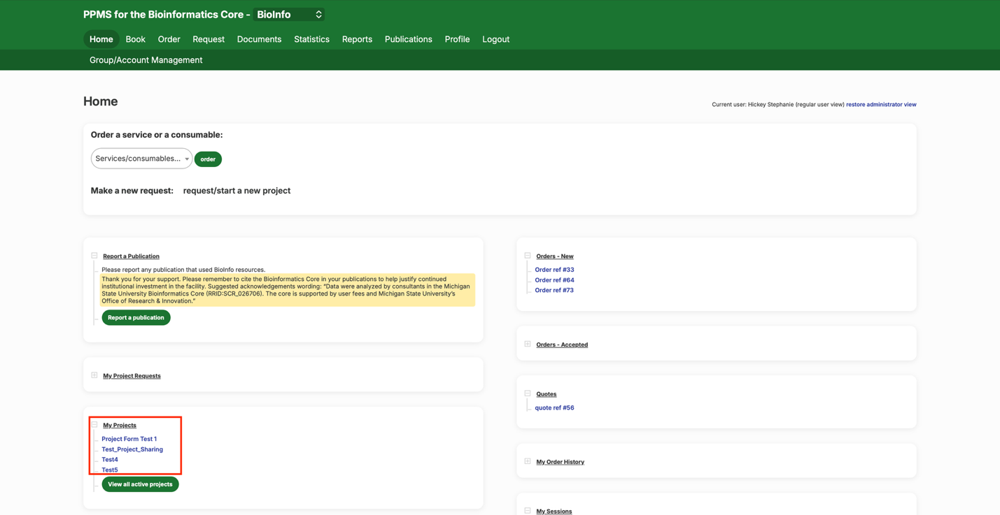
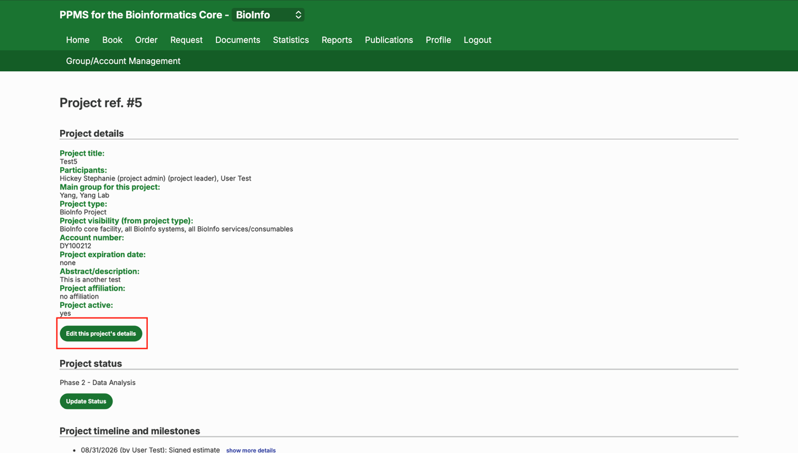
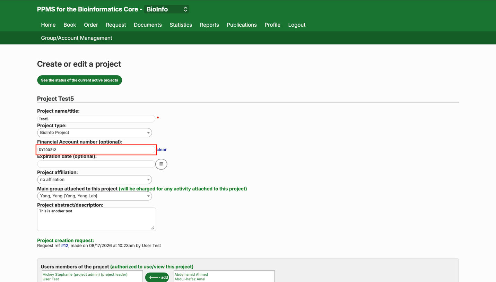
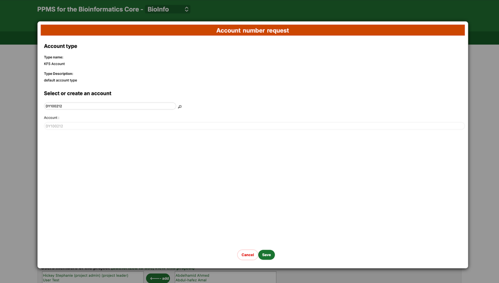
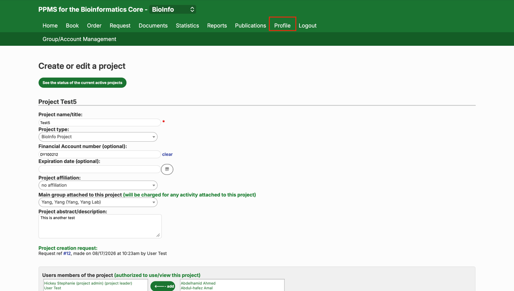
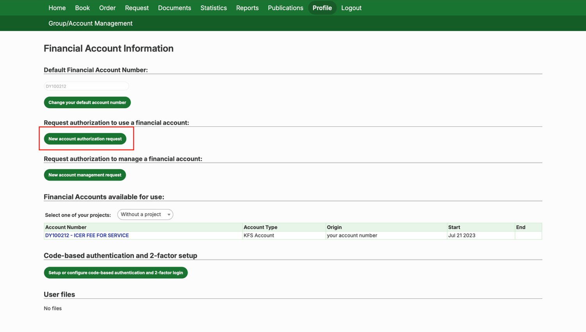
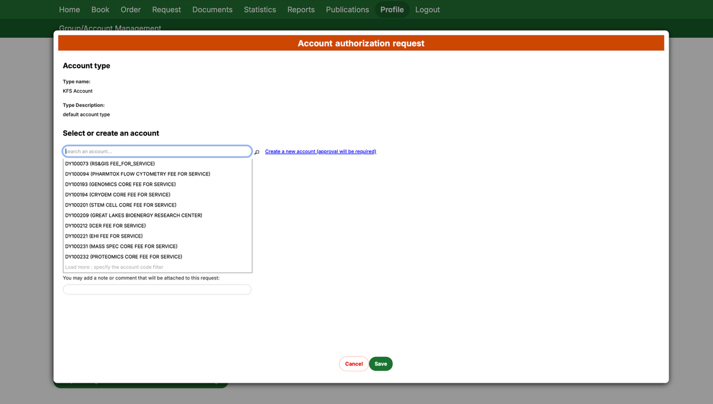
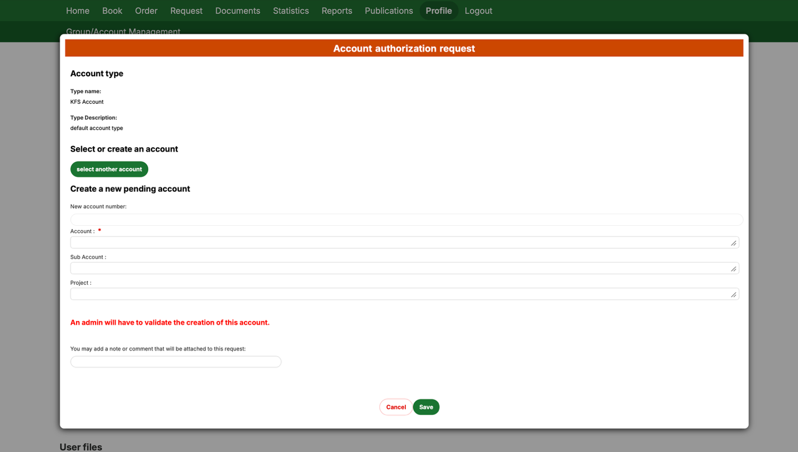

# Assigning a Financial Account to a Project in PPMS

These step-by-step instructions show how to assign a financial account to a project in PPMS, or request a new account number if one doesn't exist yet.

## Step-by-Step Guide

1. **Select your project**
   - Select your project from the "My Projects" section of the home page.

   

2. **Open the project's details**
   - Once on the project page, click "Edit this project's details."

   

3. **Find the account number field**
   - Click inside the "Financial Account number (optional)" box.

   

4. **Select or request an account**
   - You'll see the screen below. You can select an account that already exists in PPMS and that you're authorized to use. To create a new account, or to request authorization for an existing one, click "Cancel" and see Step 5 below.

   

5. **Open your profile**
   - At the top of the page, click "Profile."

   

6. **Request account authorization**
   - Scroll down to "Financial Account Information" and click "New account authorization request."

   

7. **Add your account**
   - After clicking "New account authorization request," you'll see the screen below. From here you can request authorization for an account that already exists, or create a brand-new one.

   **To use an existing account:**
   - Type the account number into the "search an account&hellip;" field and select it from the list. Click **Save** to complete the request.

   

   **To create a new account:**
   - Click "Create a new account (approval will be required)." Fill in the new account information on the following screen, then click **Save**.

   

8. **Assign the account to your project**
   - Once your request is approved, the account still needs to be linked to a project. If you entered a project reference when you submitted the request, PPMS will link it automatically. If not, return to Step 2 and enter the account number in the "Financial Account number" box to assign it directly.

<strong>Note:</strong> <em>[link to more detailed account-setup instructions, if we want one]</em>

