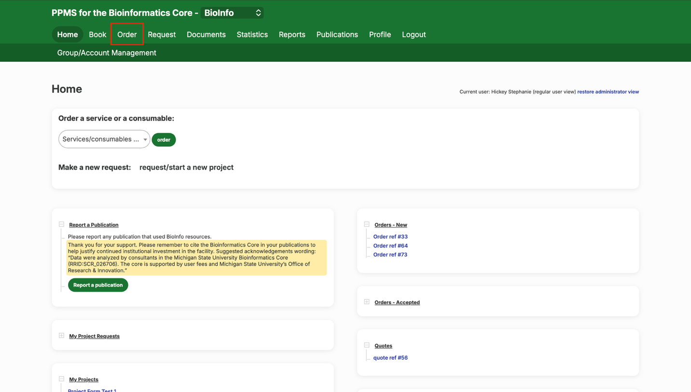
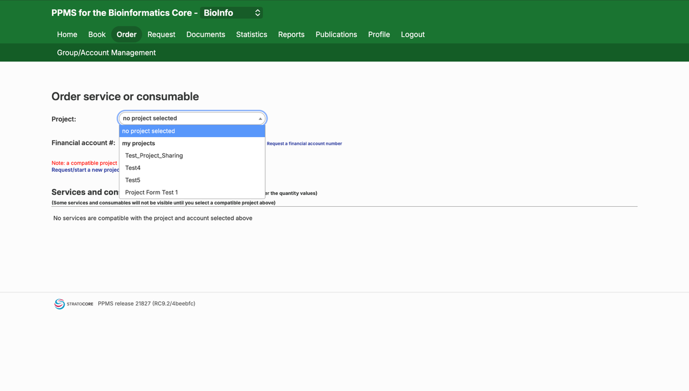
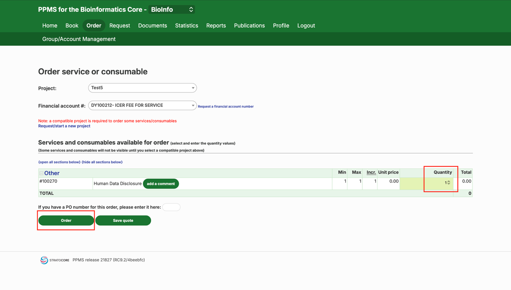
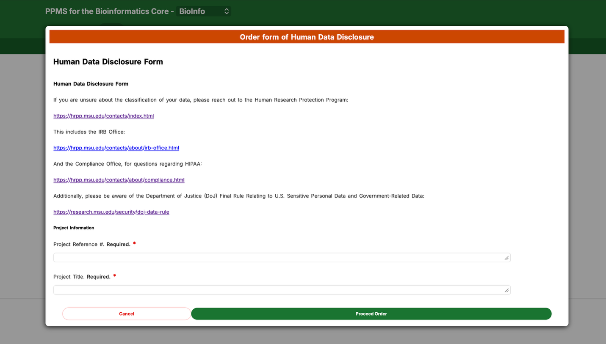

# Ordering a Human Data Disclosure Form in PPMS

These step-by-step instructions show how to order and fill out a Human Data Disclosure form in PPMS.

## Step-by-Step Guide

1. **Start an order**
   - At the top of the screen, select "Order."

   

2. **Select your project**
   - Select your project using the "Project" drop-down menu.

   

3. **Order the disclosure form**
   - Change the "Quantity" from 0 to 1 and click "Order."

   

4. **Fill out the form**
   - This pops up the Human Data Disclosure form for you to fill out.

   

<strong>Note:</strong> If you're unsure how your data should be classified, use the Human Research Protection Program, IRB Office, or Compliance Office links inside the form before you submit.

