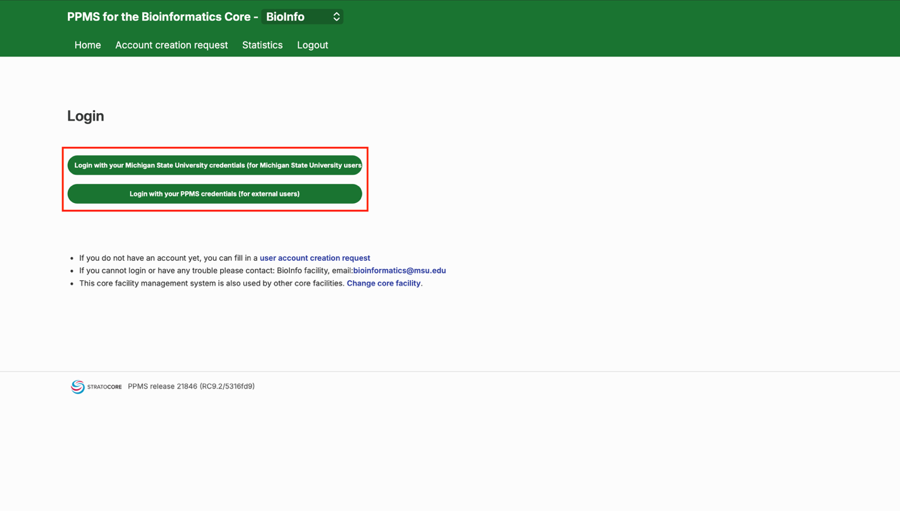
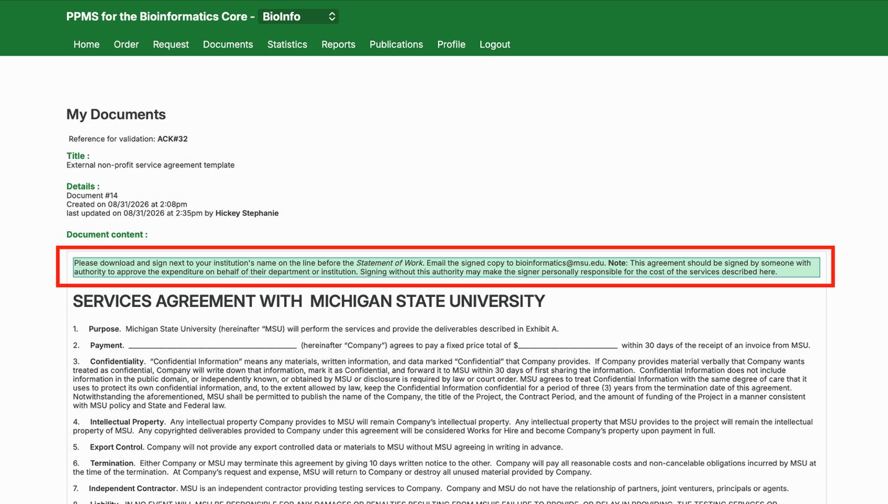
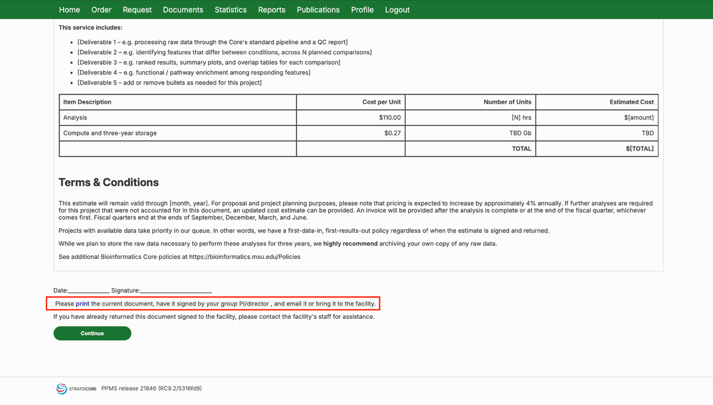
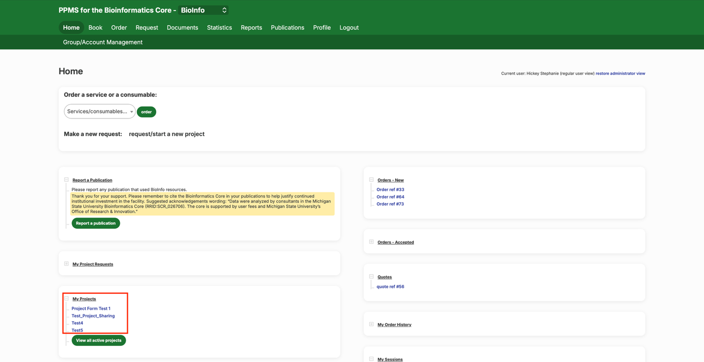
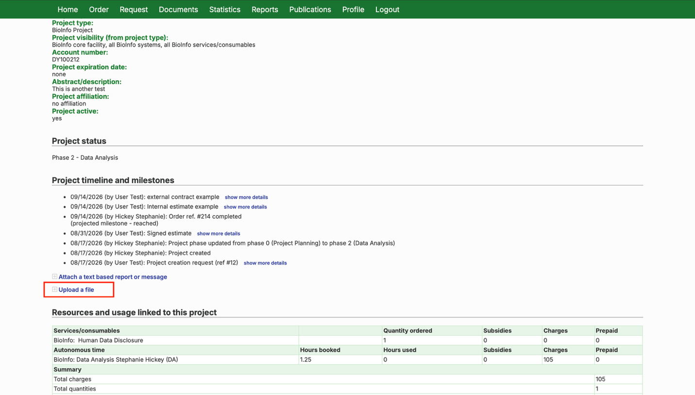
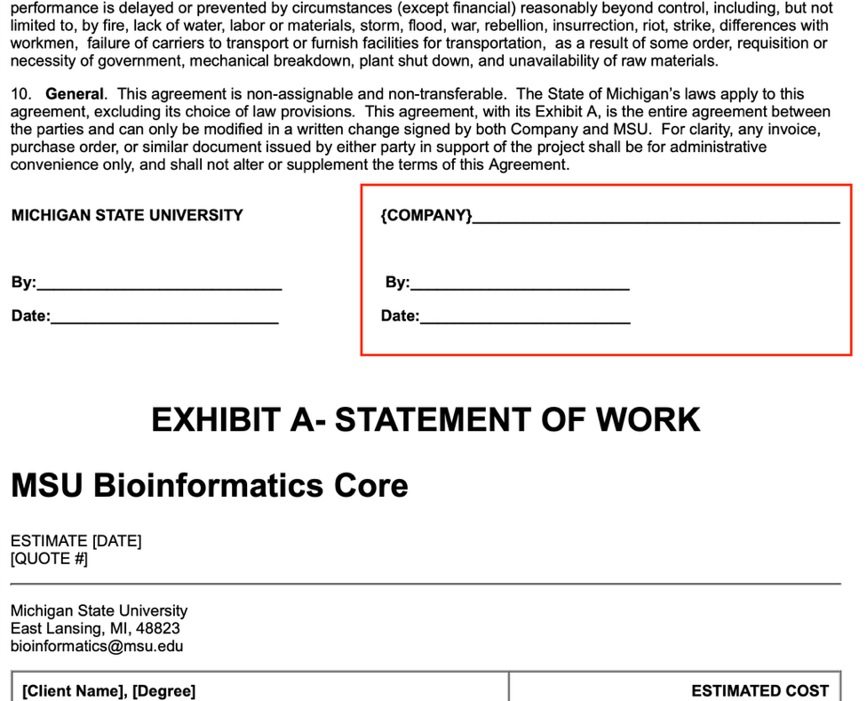
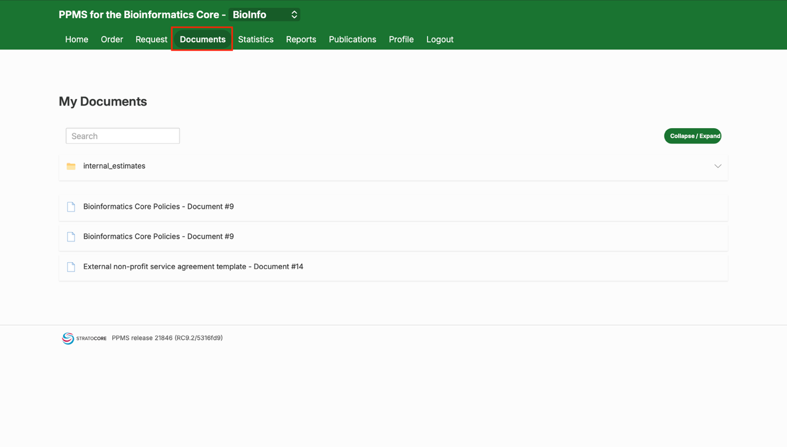

# Signing a Cost Estimate or Service Agreement in PPMS

These step-by-step instructions show how to review, sign, and return a cost estimate or service agreement in PPMS.

## Step-by-Step Guide

1. **Log in**
   - Log in using your MSU or PPMS credentials.

   

2. **Open your document**
   - Once you're logged in, you'll automatically be presented with your cost estimate (MSU researchers) or service agreement (non-MSU researchers). If it is not automatically presented, it will also be available in the Documents tab. A green box at the top of the document explains how to sign and return it.

   

3. **Print or save the document**
   - At the bottom of the document, click [print](https://ppms.us/msu-test2/vdoc/?cont=on&pf=10&docid=14&docackid=32) to print the current document or save a digital copy. Have it signed by your group PI/director. The Bioinformatics Core is a virtual facility &mdash; please don't bring the signed document in person.

   

4. **Return the signed document**
   - How you return the signed document depends on whether you're an MSU or non-MSU researcher.

   **MSU researchers:**
   - Download the estimate and have it signed by your group leader (PI). Upload the signed copy to your project page, or email it to **bioinformatics@msu.edu** with your project reference number in the subject line. You can find a link to your project page in the "My Projects" section of the home page.

   

   - On the project page, scroll to "Project timeline and milestones" and click "Upload a file" to upload the signed agreement.

   

   **Non-MSU researchers:**
   - Download and sign next to your institution's name on the line before the *Statement of Work* &mdash; **not** the signature line at the bottom of the page. Email the signed copy to **bioinformatics@msu.edu**.

   

<strong>Important:</strong> This agreement should be signed by someone with authority to approve the expenditure on behalf of their department or institution. Signing without this authority may make the signer personally responsible for the cost of the services described here.

5. **Keep a copy**
   - The unsigned version of this document will be saved in your Documents tab, in case you need it again.

   

6. **Assign a financial account**
   - Once the estimate or service agreement is signed, you'll need to assign a financial account to the associated project, if you haven't already. See [Assigning a Financial Account to a Project](./ppms_assign_account_number) for instructions.

<strong>Need help?</strong> Message our <a href="https://tinyurl.com/54dezh59">virtual help desk</a> or email <a href="mailto:bioinformatics@msu.edu">bioinformatics@msu.edu</a>.

